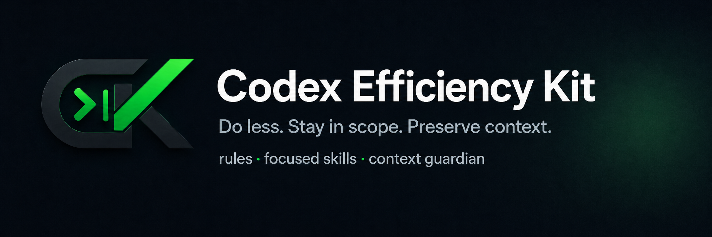

<div align="center">
  

  <p><strong>让 Codex 把上下文和算力用在真正需要的地方。</strong></p>
  <p>以 <code>$sub-agent</code> 为主轴的工程规则、定向 Skills 与上下文生命周期守护工具。</p>

  <p>
    
    
    
    
    
  </p>
</div>

> [!NOTE]
> Codex Efficiency Kit（CEK）是独立社区项目，不是 OpenAI 官方产品或官方推荐配置。

> [!IMPORTANT]
> **CEK 主推 `$sub-agent` 模式。** 由主智能体负责拆解、范围控制和最终验收，由 worker 执行有边界的实现与验证；普通任务不会未经用户授权自动拉起子智能体。

## CEK 解决什么问题？

Codex 的成本经常浪费在任务之外：为了一个局部事实重新扫描仓库、bug 尚未定位就展开多条猜测、小改动结束后继续 cleanup 和 full-suite validation，或在多次 compaction 后重复已经完成的调查。

CEK 为这些行为增加明确边界：

```text
理解请求 → 最小完整范围 → 需要时启用定向 Skill → 最小相关验证 → 停止
                         ↘ Context Guardian 监控上下文退化 ↗
```

它不尝试把每个任务变成复杂工作流，也不会替 Codex 增加一个自动路由层。核心目标只有三个：

> **Do less. Stay in scope. Preserve context.**

## 工作模型：Sub-agent 主轴，Guardian 托底

| 层级 | 作用 | 关键约束 |
| --- | --- | --- |
| **`$sub-agent` / Sol–worker** | CEK 的主工作模式：主智能体规划和验收，worker 执行局部任务 | 必须有用户明确授权；限定 write scope；不重复创建 worker；主智能体保留关键决策 |
| **Global Engineering Rules** | 约束主任务与 worker 的范围、探索和验证成本 | 最小完整改动；复用现有模式；拒绝无关重构；满足停止条件后立即结束 |
| **Focused Skills** | 为探索、调试和审查等局部任务提供有界流程 | 只在匹配场景下启用；一次解决当前问题；结果回到主智能体验收 |
| **Context Guardian** | 管理长任务的上下文生命周期 | 记录 compaction；检测重复动作；必要时要求同主模型、同推理强度的 fresh-root handoff |

### 内置 Skills

| Skill | 适用场景 | 行为重点 |
| --- | --- | --- |
| `$repo-explore` | 追踪调用链、状态流、所有权或生命周期 | 从具体锚点出发，只展开回答问题所需的最短路径 |
| `$targeted-debug` | 修复可观察的错误、崩溃、竞态或回归 | 逐个验证可证伪假设，确认 root cause 后做最小修复 |
| `$minimal-review` | 审查当前 diff 或 patch | 只报告具体、可执行的问题，不把 review 扩成仓库审计 |
| **`$sub-agent`** | **CEK 主推：用户明确授权委派** | **主智能体规划和验收，worker 执行有界实现与验证** |
| `$context-handoff` | Guardian 判断当前 root 已退化 | 将已确认状态交给全新同模型 root，不用 fork 或 worker 冒充 fresh context |

普通任务无需手动调用 Skill；当你希望强制使用某个流程时再显式调用。

## 主推模式：Sol–worker / `$sub-agent`

`$sub-agent` 是 CEK 的主推工作模式，但只在用户明确授权时启动。主智能体负责需求解释、范围、关键决策和最终验收；worker 负责有界实现、局部调查和 targeted validation。默认执行者按当前接口能力有界选择：

```text
Luna Max
  └─ max 不可用 → Luna XHigh
       └─ Luna XHigh 不可用 → Terra High
            └─ 仍不可用 → 运行时默认模型/强度
```

- 当前拉起工具明确支持 Luna Max 时，直接使用 Max；
- API 最高只提供 `xhigh` 时，保持 Luna，不因缺少 `max` 直接换模型；
- 只有明确的 model/reasoning combination unsupported 且尚未创建 worker，才允许一次兼容回退；
- 鉴权、网络、额度、超时或含糊错误不会触发重复 worker；
- 用户明确指定的模型或推理强度始终优先。

> `$sub-agent` 决定“谁来执行”；它不负责把退化的主上下文换成新上下文。

## Handoff：Sol High 必须仍然是 Sol High

`$context-handoff` 处理的是主任务上下文生命周期：

```text
old Sol root
  → .codex/CODEX_HANDOFF.md
  → brand-new Sol root（无复制历史）
  → 立即继续 NEXT_ACTION
```

Checkpoint 会记录源任务的精确主模型与 `PRIMARY_REASONING_EFFORT`。当源强度已知时，创建 replacement root 必须显式传入相同的 thinking/reasoning 参数，不能省略后依赖运行时默认值。因此 **Sol High 交接后仍应是 Sol High**，而不是静默变成 Medium。

交接遵循 fail-closed：

- 新任务必须是 brand-new root，`fork_thread` 不算 fresh context；
- 模型不匹配时报告 `MODEL_MISMATCH`；
- 已知推理强度无法保留或可观测值不匹配时报告 `REASONING_MISMATCH`；
- 新 root 必须收到 continuation 并实际开始执行，旧 root 才能结束；
- handoff 不会凭空创建子智能体授权，但可以继承同一未完成任务中用户已明确授予的 bounded delegation scope。

## Quick Start

### 推荐入口：从 `$sub-agent` 开始

如果任务适合拆成一个清晰的执行单元，推荐直接显式调用 `$sub-agent`：

```text
$sub-agent
由主智能体规划和验收。请让 worker 在限定范围内完成这个改动，并运行最小相关验证。
```

主智能体不会把需求解释、架构取舍或最终验收外包给 worker；worker 的结果必须回到主任务核验。若任务不适合委派，直接执行即可。

### Requirements

- 已安装并可以正常使用 Codex；
- Python 3.10+（安装器与 Guardian 仅使用标准库）；
- Codex hooks 可用，并允许在 `/hooks` 中审核和信任新增 hooks；
- Git（用于克隆仓库）。

### Install

Linux / macOS：

```bash
git clone https://github.com/yonghengbit/codex-efficiency-kit.git
cd codex-efficiency-kit
python3 install.py
```

Windows PowerShell：

```powershell
git clone https://github.com/yonghengbit/codex-efficiency-kit.git
cd codex-efficiency-kit
py -3 .\install.py
```

自定义 Codex home：

```bash
python3 install.py --codex-home /path/to/.codex
```

安装器默认在覆盖已有内容前创建时间戳备份。仅在明确不需要备份时使用：

```bash
python3 install.py --no-backup
```

安装完成后，打开 Codex 的 `/hooks`，审核并信任 CEK 新增的 `PostCompact`、`PostToolUse` 和 `Stop` hooks，然后开始一个新任务。

## 使用示例

### 主推：委派一个有边界的执行单元

```text
$sub-agent
实现这个有边界的改动：只修改指定模块，由主智能体完成最终验收，并运行 targeted validation。
```

### 其他定向 Skills

```text
$repo-explore
从 handle_request 开始，追踪请求进入 prefill batch 的最小调用链。
```

```text
$targeted-debug
并发请求的首 token 偶尔变成 EOS。请定位 root cause 并做 targeted validation。
```

```text
$minimal-review
审查当前 diff，只报告会影响合并的具体问题。
```

`$context-handoff` 通常由 Context Guardian 在长任务上下文退化时触发，不应拿来替代普通委派。

## 安装器如何保护现有配置

默认安装目标是 `~/.codex`：

| 路径 | 安装行为 |
| --- | --- |
| `AGENTS.md` | 只创建或替换 `CODEX EFFICIENCY KIT` 标记区间，保留区间外内容 |
| `skills/` | 安装或更新 CEK 提供的五个 Skills |
| `context-guardian/` | 更新 Guardian 脚本；已有 `config.json` 不覆盖 |
| `hooks.json` | 合并 Guardian hooks，不删除非 Guardian hooks |
| `backups/<timestamp>/` | 默认保存被替换的规则、Skills、脚本和 hooks |

这让 CEK 可以叠加到已有个人配置上，而不要求接管整个 Codex home。

## Context Guardian

默认阈值位于 `~/.codex/context-guardian/config.json`：

```json
{
  "soft_compactions": 2,
  "hard_compactions": 3,
  "max_handoff_attempts": 2,
  "repeat_threshold": 3,
  "max_state_entries": 256,
  "track_repetition_after_compaction": true
}
```

| Hook | 行为 |
| --- | --- |
| `PostCompact` | 记录 compaction 次数，并提醒保留已确认结论 |
| `PostToolUse` | compaction 后检测重复工具动作与路径访问，发出有界 drift signal |
| `Stop` | 未完成任务达到阈值时要求完成或明确处理 handoff gate |

查看当前状态：

```bash
python3 ~/.codex/context-guardian/context_guardian.py --status
```

Windows：

```powershell
py -3 "$HOME\.codex\context-guardian\context_guardian.py" --status
```

## Repository Layout

```text
codex-efficiency-kit/
├── assets/
│   └── hero.png
├── AGENTS.md
├── VERSION
├── install.py
├── skills/
│   ├── repo-explore/
│   ├── targeted-debug/
│   ├── minimal-review/
│   ├── sub-agent/
│   └── context-handoff/
├── context-guardian/
│   ├── context_guardian.py
│   └── config.json
└── tests/
```

## Upgrade & Validation

更新仓库后重新运行安装器即可；它会更新 CEK 管理的规则、Skills、Guardian 和 hooks，同时保留已有 Guardian 配置。

```bash
git pull
python3 install.py
python3 -m unittest discover -s tests -v
```

## Project Status & License

当前版本：**3.5.0**。

仓库目前未提供明确的开源许可证。公开可见不自动授予复制、修改或再发布许可；如果计划接受外部贡献或正式开源分发，应补充 `LICENSE`。

## Disclaimer

Codex Efficiency Kit 是独立项目，与 OpenAI 不存在隶属、赞助或官方背书关系。`Codex`、`OpenAI` 及相关商标归其权利人所有；本项目使用独立的 “context loop + terminal execution” 视觉语言。
